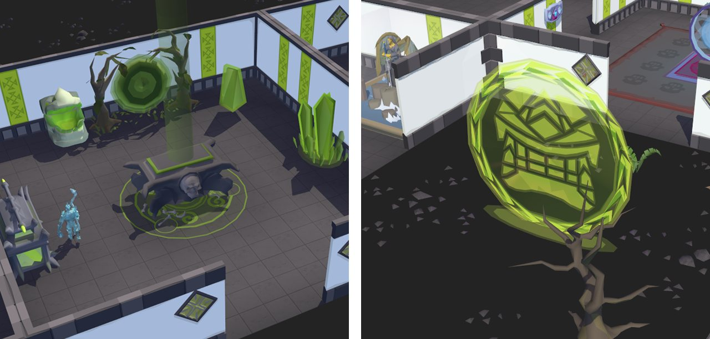
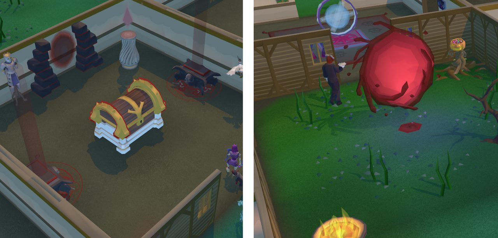
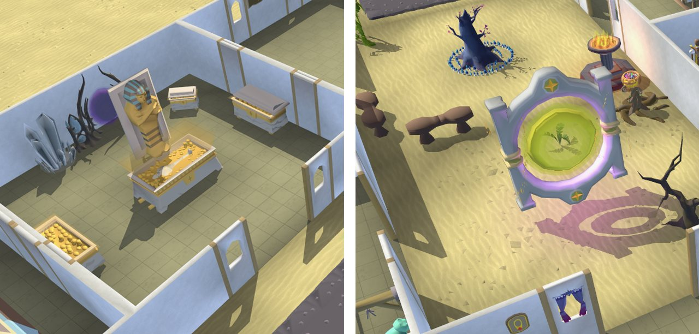

# PoH Furniture Transmog

A cosmetic RuneLite plugin that allows users to transmog specific PoH furniture and props into curated, whitelisted objects.

- Supported targets and appearances are deliberately restricted. No arbitrary object IDs.
- The original clickbox is preserved to protect gameplay integrity.
- Currently, only the entrance portal and costume-room furniture are eligible transmog targets. Furniture tied to official cosmetic upgrades, GP sinks, gamemode rewards, or visible accomplishments remains excluded, including portal-space portals, portal nexuses, scrying pools, spirit trees, thrones, house styles, and Achievement Gallery furniture.
- Appearances that cannot normally be applied to an eligible slot, such as the Raging Echoes portal frame on the PoH entrance portal, may still be allowed. Orange is intentionally unavailable as an entrance-portal recolour because it is reserved for the Wilderness house theme, a premium cosmetic obtained with a Deadman reward scroll.

GPU or 117 HD is required so the plugin can hide original scenery through RuneLite's supported render callback.

All changes are cosmetic only and local to the user's RuneLite client.

